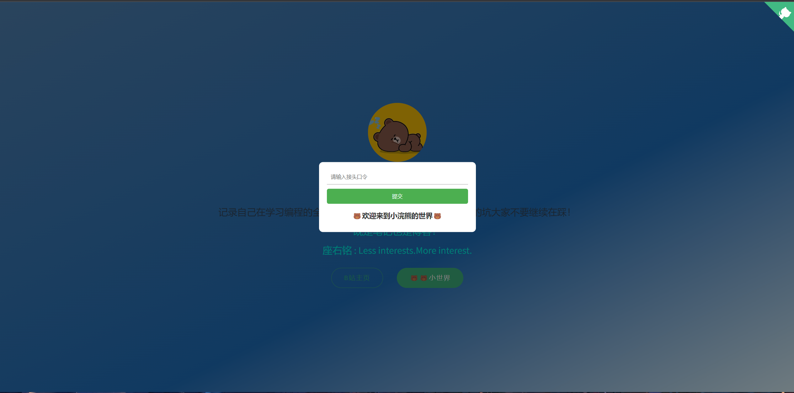
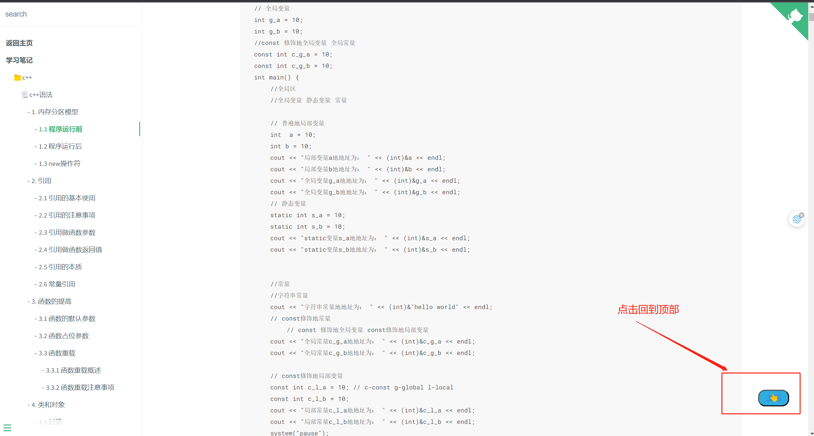
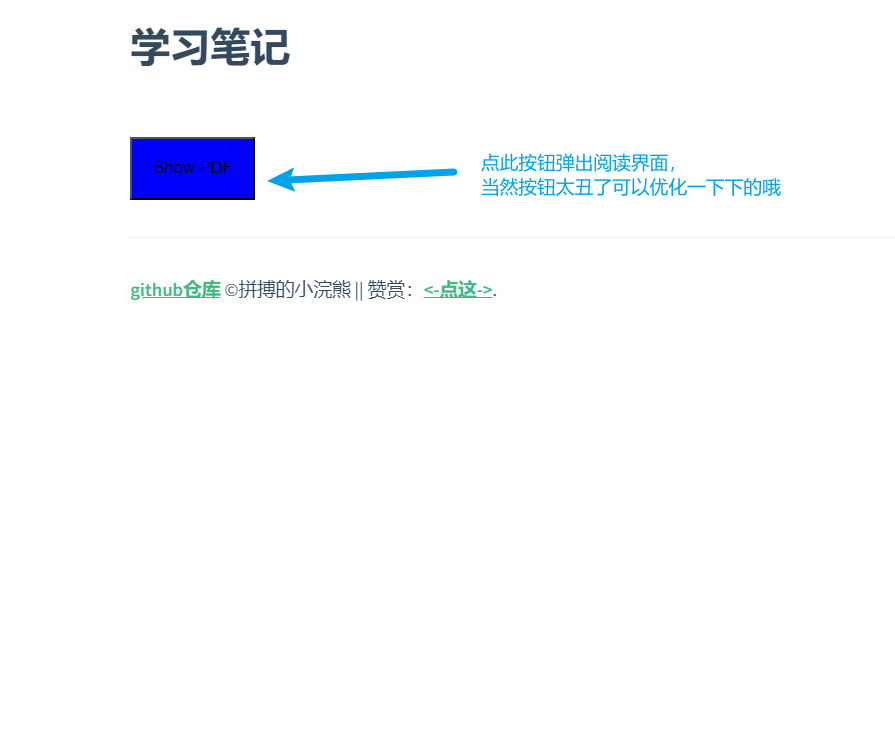
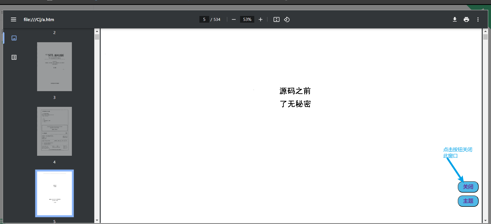

# 笔记的开发模板

+ 主要是当作个人笔记或者个人的知识库来做的，分享出来希望各位小伙伴也可以用来做自己的知识库，这是我的荣幸。
+ 本项目是基于“docsify”来开发的，个人也会不间断的开发一些小功能给此项目。
+ 如果小伙伴有什么好的想法，都可以提出来，大家一起开发一些小功能。
+ 本项目所用到的js文件、css文件均在本地，没有三方的url，所以很稳定，大家放心使用。
> 记录自己的学习过程，应该是一件很开心的过程，笔记只有自己的往往，看的时候才是最熟悉的，学的最快的。

> 个人知识库记录有以下内容

# 功能分区

## 输入密码验证登录
> 只是防止小白的，稍微有点技术的人，分分钟破解，为了减少一下有人恶意访问而已。
+ 文件：`./src/js/password.js`
1. 采用cookie过期，来做长久登录
2. 当cookie值不正确或者不存在的时候，则需要输入密码进行验证。
3. 验证通过就会将正确的cookie存入到浏览器cookie中。



## 回到顶部
> 当文档读到一定的位置我们想要回到顶部，滑动滚动条比较费时费力，所以这么一个小按钮就比较重要，可以很大程度上帮助我们。
+ 文件：`./src/js/clickHeader.js`
+ 当滚动条在一定的位置之后才会显示出来



## 模板使用（ 使用必看）

1. 首先安装 `docsify`（此处需要配置node环境）

   + 执行安装：`npm i docsify-cli -g`
2. 在根目录下执行 `docsify serve docs`运行笔记

   + 部署 `github page`请参考 https://zjxweb.github.io/#/tips/docsify/
3. 建议每个文件目录结构如下

   + `src`（目录用来存放这个笔记所需的静态文件——比如图片等）
   + `README.md`(必须要有的，这个模块的笔记就写到这个里面)
4. 笔记模板的目录配置文件是——  `sidebar.md`
5. **具体示例可以看 `study`这个模块**，来搭建自己的笔记

> 有任何问题都可以联系本人——https://zjxweb.github.io/#/onself

## dpf阅读器（不止可以放pdf文件哦，任何文件都可以哦，包括图片、链接等）
> 此处的pdf阅读器，我将其 封装到了一个组件中，方便大家使用。
> 1. 在 `index.html`中引入相对应的js文件 

```js
<script src="./src/js/pdfShow.js"></script>
```
+ 注意你自己放的位置哦
  
2. 在你需要的`.md`文件中直接引入组件就好
```js
<iframe-component src="./src/pdf/stl.pdf"></iframe-component>
```
> 注意：此处的`src`就是你的pdf的路径
+ 结果图1——点击按钮弹出阅读界面
  
+ 结果图2——阅读界面及其关闭按钮
  