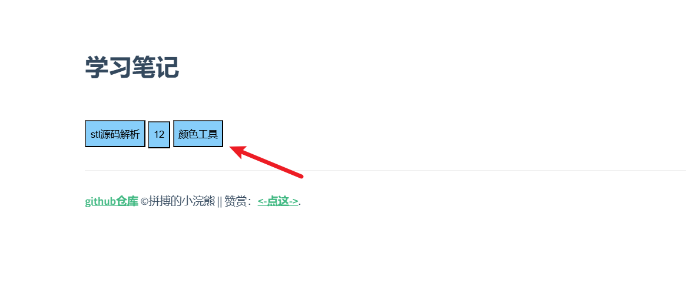
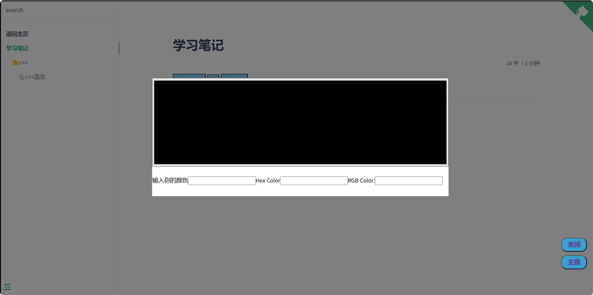

# 笔记的开发模板

+ 主要是当作个人笔记或者个人的知识库来做的，分享出来希望各位小伙伴也可以用来做自己的知识库，这是我的荣幸。

+ 本项目是基于“docsify”来开发的，个人也会不间断的开发一些小功能给此项目。

+ 如果小伙伴有什么好的想法，都可以提出来，大家一起开发一些小功能。

+ 本项目所用到的js文件、css文件均在本地，没有三方的url，所以很稳定，大家放心使用。
  
  > 记录自己的学习过程，应该是一件很开心的过程，笔记只有自己的往往，看的时候才是最熟悉的，学的最快的。

> 个人知识库记录有以下内容

# 功能分区

## 输入密码验证登录

> 只是防止小白的，稍微有点技术的人，分分钟破解，为了减少一下有人恶意访问而已。

+ 文件：`./src/js/password.js`
1. 采用cookie过期，来做长久登录
2. 当cookie值不正确或者不存在的时候，则需要输入密码进行验证。
3. 验证通过就会将正确的cookie存入到浏览器cookie中。


## 回到顶部

> 当文档读到一定的位置我们想要回到顶部，滑动滚动条比较费时费力，所以这么一个小按钮就比较重要，可以很大程度上帮助我们。

+ 文件：`./src/js/clickHeader.js`
+ 当滚动条在一定的位置之后才会显示出来

## 模板使用（ 使用必看）

1. 首先安装 `docsify`（此处需要配置node环境）
   
   + 执行安装：`npm i docsify-cli -g`

2. 在根目录下执行 `docsify serve docs`运行笔记
   
   + 部署 `github page`请参考 https://zjxweb.github.io/#/tips/docsify/

3. 建议每个文件目录结构如下
   
   + `src`（目录用来存放这个笔记所需的静态文件——比如图片等）
   + `README.md`(必须要有的，这个模块的笔记就写到这个里面)

4. 笔记模板的目录配置文件是——  `sidebar.md`

5. **具体示例可以看 `study`这个模块**，来搭建自己的笔记

> 有任何问题都可以联系本人——https://zjxweb.github.io/#/onself

## PDF阅读器（不止可以放pdf文件哦，任何文件都可以哦，包括图片、链接等）

> 此处的pdf阅读器，我将其 封装到了一个组件中，方便大家使用。按钮的名字会根据你传入的pdf链接自动进行截取
> 
> 1. 在 `index.html`中引入相对应的js文件 

```js
<script src="./src/js/pdfShow.js"></script>
```

+ 注意你自己放的位置哦
2. 在你需要的`.md`文件中直接引入组件就好
   
   ```js
   <iframe-component src="./src/pdf/stl.pdf"></iframe-component>
   ```
   
   > 注意：此处的`src`就是你的pdf的路径
+ 结果图1——点击按钮弹出阅读界面
  
+ 结果图2——阅读界面及其关闭按钮
  

> 最后记得在 `src/css/index.css`中加入以下样式

```css
/* github图标层级 */
.github-corner{
    z-index: 0!important;
}
```

## `EPUB`电子书解析

使用方式可以参考上方的使用

1. 引入对应的js

```html
  <script src="./src/js/pdfShow.js"></script>
  <script src="./src/js/epub/jszip.min.js"></script>
  <script src="./src/js/epub/Blob.min.js"></script>
  <script src="./src/js/epub/deflate.min.js"></script>
  <script src="./src/js/epub/inflate.min.js"></script>
  <script src="./src/js/epub/jquery.min.js"></script>
  <script src="./src/js/epub/epub.js"></script>
  <script src="./src/js/epubPage.js"></script>
```

> 如果没有前端的基础，请不要随意更改上方js的引入顺序

2. 接下来就可以使用了

```markdown
<div-component src="./src/pdf/12.epub"></div-component>
```

> src后面加的依然是对应的路径


## 颜色选择器及其16进制和rgb转换

> 功能：
> 
> 1. 我们可以通过颜色选择器来选择自己喜欢得颜色，并且得到对应的16进制和rgb的颜色的值；
> 
> 2. 如果我们已知了16进制和rgb对应的值，我们可以将其输入，来查看是什么颜色，同时也可以得到对应的rgb和16进制的颜色数值；
> 
> 3. 已经将其封装成组件，大家可以进行一键引入，使用哦；

+ 使用步骤：基本和之前的组件使用方法一样
  
  1. 在`index.html`文件引入我们的js文件    
  + ```js
    <!-- 颜色选择器 -->
      <script src="./src/js/color.js"></script>
    ```
2. 在想要用到的地方就可以直接写标签使用了，`markdown文件也是可以用的哦`
   
   + ```js
     <color-tool></color-tool>
     ```

> 效果图



